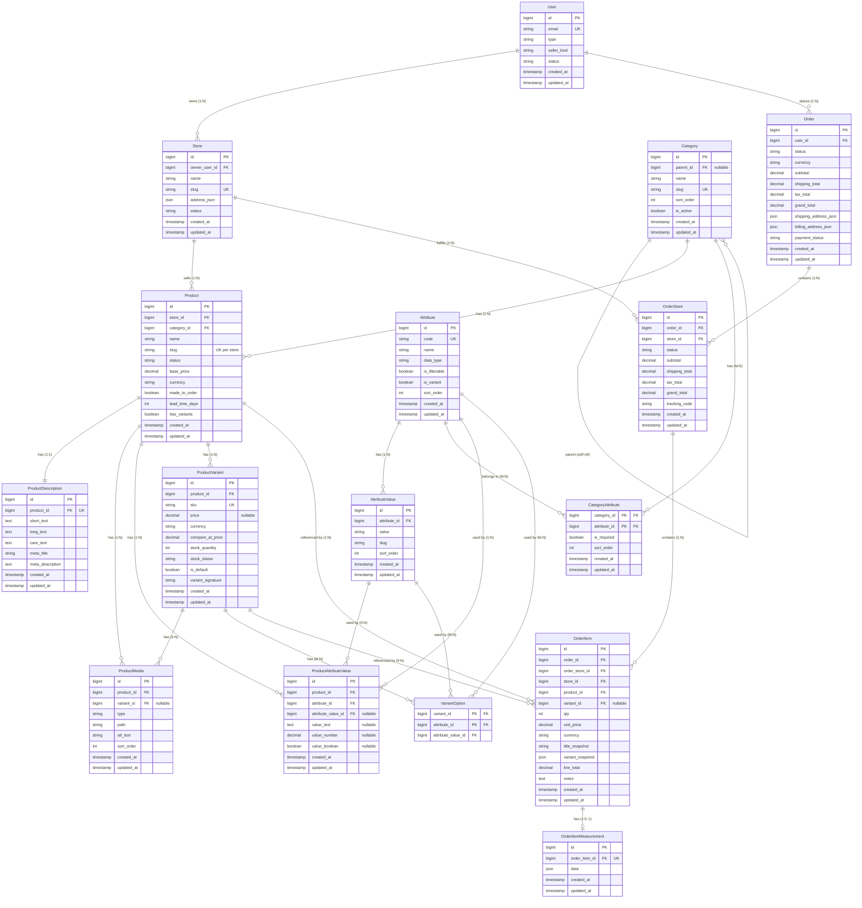

# Entity Relationship Diagram (ERD)
## Multi-Vendor Fashion Marketplace Platform

## Key Relationships Summary

### Identity & Stores
- **User 1 → N Store**: A user can own multiple stores

### Categories & Products
- **Category 1 → N Category**: Self-referential hierarchy (parent_id)
- **Category 1 → N Product**: Products belong to categories
- **Store 1 → N Product**: Products belong to stores
- **Product 1 → 1 ProductDescription**: One-to-one product descriptions
- **Product 1 → N ProductMedia**: Products have multiple media items
- **ProductVariant 0 → N ProductMedia**: Variants can have their own media

### Attributes & Filtering
- **Attribute 1 → N AttributeValue**: Attributes have multiple possible values
- **Category M → N Attribute**: Categories can have multiple attributes (via CategoryAttribute pivot)
- **Product 1 → N ProductAttributeValue**: Products have attribute values
- **Attribute 1 → N ProductAttributeValue**: Attributes are used by products
- **AttributeValue 0 → N ProductAttributeValue**: Attribute values are used (nullable if text/number/boolean)

### Variants
- **Product 1 → N ProductVariant**: Products have variants
- **ProductVariant M → N Attribute M → N AttributeValue**: Variants have options (via VariantOption pivot)

### Orders (Marketplace)
- **User 1 → N Order**: Users place orders
- **Order 1 → N OrderStore**: Orders contain store-level sub-orders
- **Store 1 → N OrderStore**: Stores fulfill store-level orders
- **OrderStore 1 → N OrderItem**: Store orders contain items
- **Product 1 → N OrderItem**: Order items reference products (read-only snapshot)
- **ProductVariant 0 → N OrderItem**: Order items may reference variants (read-only snapshot)
- **OrderItem 1 → 0..1 OrderItemMeasurement**: Order items may have custom measurements

## Important Notes

1. **Products do NOT directly connect to Attributes or AttributeValues** - all connections go through ProductAttributeValue
2. **Orders do NOT directly connect to Products or ProductVariants** - OrderItem is the only bridge, storing snapshots
3. **Marketplace entities (Orders) are separated from catalog entities (Products)** while maintaining proper relationships through OrderItem
